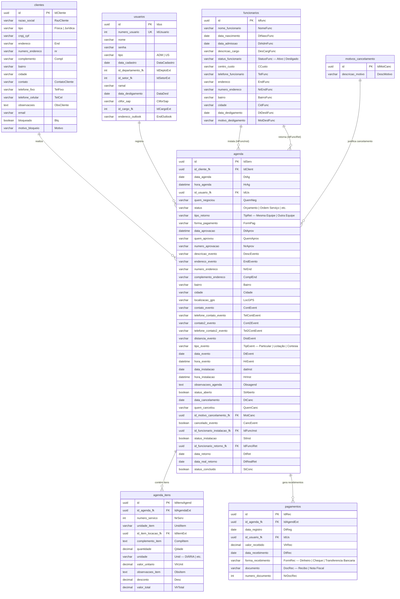
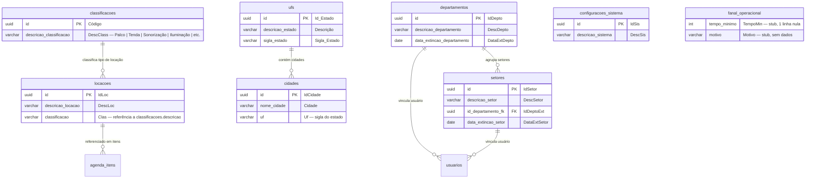

# ERD Legado — Radelgo

> Sistema de gestão de locação de equipamentos de eventos (palco, som, iluminação, tendas, veículos).
> Banco de dados original: Microsoft Access. Exportação: 24 arquivos CSV.
> Nomenclatura migrada para snake_case sem abreviações ou caracteres especiais.

---

## Tabelas Enum Identificadas

Tabelas com poucos registros (< 50) e estrutura id + descrição tratadas como enums no novo schema.

| Tabela Original | Tabela Nova             | Linhas | Colunas                          | Valores / Notas                                                                     |
|-----------------|-------------------------|--------|----------------------------------|-------------------------------------------------------------------------------------|
| `CadClass`      | `classificacoes`        | 11     | codigo, descricao                | Palco, Tenda, Sonorização, Iluminação, Grupo Gerador, Mesas e Cadeiras, Banheiros, Climatizador, Caixa Termica, Estrutura, Extras |
| `CadSys`        | `configuracoes_sistema` | 3      | id, descricao                    | CONTROLE DESCARGA, CONTROLE CARREGAMENTO, CENTRAL DE MINUTAS                        |
| `TabMotCanc`    | `motivos_cancelamento`  | 5      | id, descricao_motivo             | Outra empresa, Evento cancelado, Sem equipamento, Valor não compensava, Duplicidade |
| `CadUF`         | `ufs`                   | 27     | id_estado, descricao, sigla      | 27 estados brasileiros                                                              |
| `CadDepto`      | `departamentos`         | 20     | id, descricao, data_extincao     | Controladoria, RH, Manutenção, etc. (legado ERP anterior)                           |
| `CadSetor`      | `setores`               | 65     | id, descricao, id_depto_fk, data_extincao | Vinculado a departamentos — estrutura organizacional legada             |
| `FanalOper`     | `fanal_operacional`     | 1      | tempo_minimo, motivo             | Tabela vazia/stub — 1 linha completamente nula                                      |

> **Nota:** `CadLocacao` (161 linhas, 3 colunas: id, descricao, classe) é uma tabela de catálogo de tipos de serviço, não é um enum simples mas funciona como lookup. `TabCidade` (139 linhas) é lookup de cidades por UF.

---

## ERD — Domínio Principal (Clientes, Agenda, Usuários, Funcionários)

---

## ERD — Domínio de Recursos (Frota e Equipamentos)

```mermaid
erDiagram

    veiculos {
        uuid id PK "IdVeic"
        varchar descricao_veiculo "DescVeic"
        varchar placa "Placa"
        varchar marca_veiculo "MarcaVeic"
        date data_aquisicao "DtAquis"
        varchar renavan "Renavan"
        varchar chassi "Chassi"
        varchar ano_fabricacao "AnoFab — ex: 2010/2010"
        varchar combustivel "Comb"
        varchar cnpj_proprietario "CNPJ"
        varchar numero_apolice_vigente "NrApoVig"
    }

    saida_veiculos {
        uuid id PK "IdSaidVeic"
        uuid id_evento_fk FK "IdEvento"
        uuid id_veiculo_fk FK "IdVeicExt"
        decimal km_saida "KmSaida"
        decimal km_retorno "KmRet"
    }

    saida_veiculos_retorno {
        uuid id PK "IdSaidVeic"
        uuid id_evento_fk FK "IdEvento"
        uuid id_veiculo_fk FK "IdVeicExt"
        decimal km_saida "KmSaida"
        decimal km_retorno "KmRet"
    }

    equipamentos {
        uuid id PK "IdEquip"
        varchar descricao_equipamento "DescEquip"
        varchar marca "Marca"
        decimal valor "Vlr"
        boolean sem_uso "SemUso"
    }

    equipamentos_saida {
        uuid id PK "IdItemEquip"
        uuid id_agenda_fk FK "IdAgendExt"
        uuid id_equipamento_fk FK "IdItemExt"
        decimal quantidade_saida "QdaSaida"
    }

    escalas {
        uuid id PK "IdEscala"
        uuid id_agenda_fk FK "IdServExt"
        uuid id_funcionario_fk FK "IdFuncExt"
    }

    escalas_retorno {
        uuid id PK "IdEscala"
        uuid id_agenda_fk FK "IdServExt"
        uuid id_funcionario_fk FK "IdFuncExt"
    }

    fotos {
        uuid id PK "IdFotos"
        uuid id_evento_fk FK "IdEvent"
        varchar url_foto "Foto — url (S3-compatible reference)"
    }

    kits {
        uuid id PK "IdKit"
        uuid id_item_locacao_fk FK "IdItemLocExt"
        uuid id_equipamento_fk FK "IdItemEquipExt"
        int quantidade_item "QdeItem"
        uuid id_usuario_cadastro_fk FK "IdUsCad"
    }

    agenda ||--o{ saida_veiculos : "usa veículos (saída)"
    agenda ||--o{ saida_veiculos_retorno : "usa veículos (retorno)"
    veiculos ||--o{ saida_veiculos : "alocado em"
    veiculos ||--o{ saida_veiculos_retorno : "retornado de"
    agenda ||--o{ equipamentos_saida : "saída de equipamentos"
    equipamentos ||--o{ equipamentos_saida : "alocado em"
    agenda ||--o{ escalas : "escala de ida"
    agenda ||--o{ escalas_retorno : "escala de retorno"
    funcionarios ||--o{ escalas : "escalado para"
    funcionarios ||--o{ escalas_retorno : "retorno de"
    agenda ||--o{ fotos : "documentado em"
    locacoes ||--o{ kits : "composto de equipamentos"
    equipamentos ||--o{ kits : "incluso em kit"
    usuarios ||--o{ kits : "cadastrado por"
```

---

## ERD — Domínio Financeiro e Agenda (Catálogos e Lookups)

---

## Mapeamento Completo de Foreign Keys

| Tabela Origem          | Coluna FK                  | Tabela Destino         | Coluna PK         |
|------------------------|----------------------------|------------------------|-------------------|
| `agenda`               | `id_cliente_fk`            | `clientes`             | `id`              |
| `agenda`               | `id_usuario_fk`            | `usuarios`             | `id`              |
| `agenda`               | `id_motivo_cancelamento_fk`| `motivos_cancelamento` | `id`              |
| `agenda`               | `id_funcionario_instalacao_fk` | `funcionarios`     | `id`              |
| `agenda`               | `id_funcionario_retorno_fk`| `funcionarios`         | `id`              |
| `agenda_itens`         | `id_agenda_fk`             | `agenda`               | `id`              |
| `agenda_itens`         | `id_item_locacao_fk`       | `locacoes`             | `id`              |
| `pagamentos`           | `id_agenda_fk`             | `agenda`               | `id`              |
| `pagamentos`           | `id_usuario_fk`            | `usuarios`             | `id`              |
| `equipamentos_saida`   | `id_agenda_fk`             | `agenda`               | `id`              |
| `equipamentos_saida`   | `id_equipamento_fk`        | `equipamentos`         | `id`              |
| `saida_veiculos`       | `id_evento_fk`             | `agenda`               | `id`              |
| `saida_veiculos`       | `id_veiculo_fk`            | `veiculos`             | `id`              |
| `saida_veiculos_retorno` | `id_evento_fk`           | `agenda`               | `id`              |
| `saida_veiculos_retorno` | `id_veiculo_fk`          | `veiculos`             | `id`              |
| `escalas`              | `id_agenda_fk`             | `agenda`               | `id`              |
| `escalas`              | `id_funcionario_fk`        | `funcionarios`         | `id`              |
| `escalas_retorno`      | `id_agenda_fk`             | `agenda`               | `id`              |
| `escalas_retorno`      | `id_funcionario_fk`        | `funcionarios`         | `id`              |
| `fotos`                | `id_evento_fk`             | `agenda`               | `id`              |
| `kits`                 | `id_item_locacao_fk`       | `locacoes`             | `id`              |
| `kits`                 | `id_equipamento_fk`        | `equipamentos`         | `id`              |
| `kits`                 | `id_usuario_cadastro_fk`   | `usuarios`             | `id`              |
| `setores`              | `id_departamento_fk`       | `departamentos`        | `id`              |
| `usuarios`             | `id_departamento_fk`       | `departamentos`        | `id`              |
| `usuarios`             | `id_setor_fk`              | `setores`              | `id`              |
| `cidades`              | `uf`                       | `ufs`                  | `sigla_estado`    |
| `locacoes`             | `classificacao`            | `classificacoes`       | `descricao_classificacao` |

---

## Observações de Migração

1. **`agenda.hora_agenda` e campos de hora** — valores como `1899-12-30 08:45:33` são artefatos do Access para campos do tipo `Time`; devem ser migrados extraindo apenas a parte `HH:MM:SS` como `time`.
2. **`TabEquipSaida` vs `TabAgendaItens`** — ambas referenciam `IdAgendExt` e `IdItemExt`. `TabAgendaItens` registra o item de locação contratado (catálogo); `TabEquipSaida` registra os equipamentos físicos efetivamente saídos do estoque.
3. **`TabEscala` vs `TabEscalaRet`** — estrutura idêntica; `TabEscala` é escala de ida/montagem, `TabEscalaRet` é escala de retorno/desmontagem.
4. **`TabSaidaVeic` vs `TabSaidaVeicRet`** — estrutura idêntica; mesma separação ida/retorno para veículos.
5. **`TabKit`** — relaciona tipos de locação (`CadLocacao`) com equipamentos físicos (`TabEquip`), definindo quais equipamentos compõem cada "kit" padrão de um serviço.
6. **`CadDepto` e `CadSetor`** — parecem ser estrutura organizacional de um ERP anterior (contêm setores de indústria alimentícia); no contexto Radelgo funcionam apenas como lookup para `CadUsuario`.
7. **`FanalOper`** — tabela stub com 1 linha totalmente nula; provavelmente placeholder não utilizado.
8. **`TabFotos.Foto`** — campo com valor "fotos" (literal texto), indica que o Access armazenava referências de caminho de arquivo; migrar como `varchar` com semântica de URL S3.
