# Diagramas - ERP de Locações e Leasing de Projetos

## 1. Ciclo de Vida da Ordem de Serviço

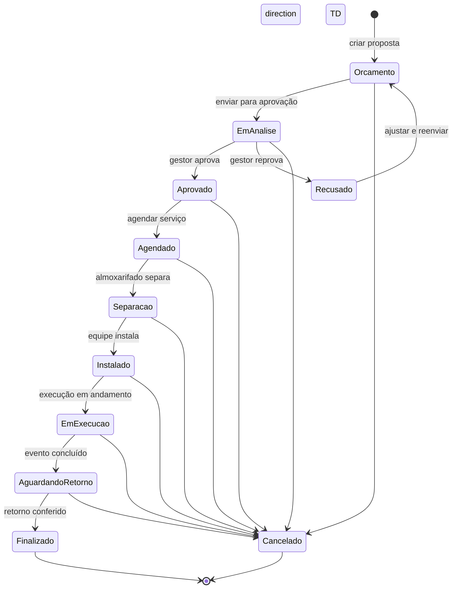

---

## 2. Fluxo Comercial

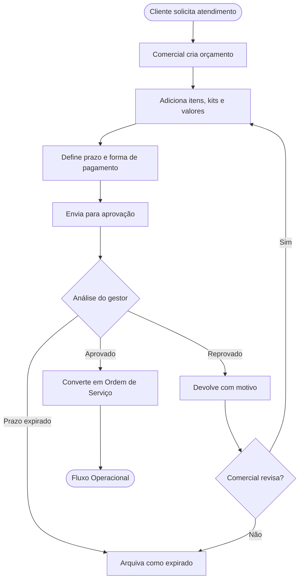

---

## 3. Fluxo Operacional

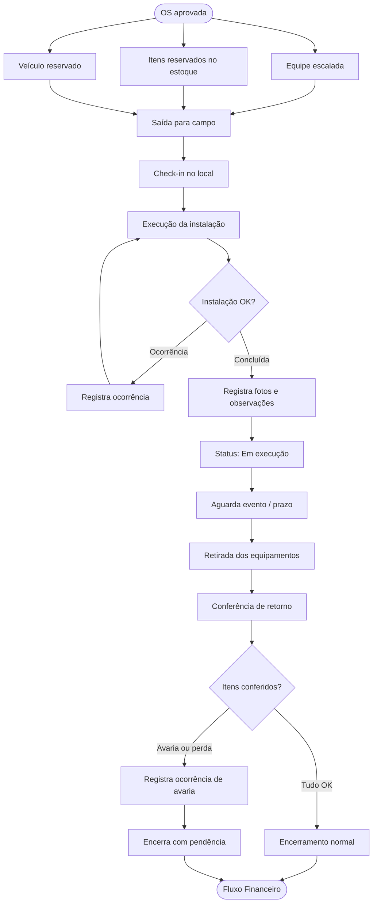

---

## 4. Fluxo Financeiro

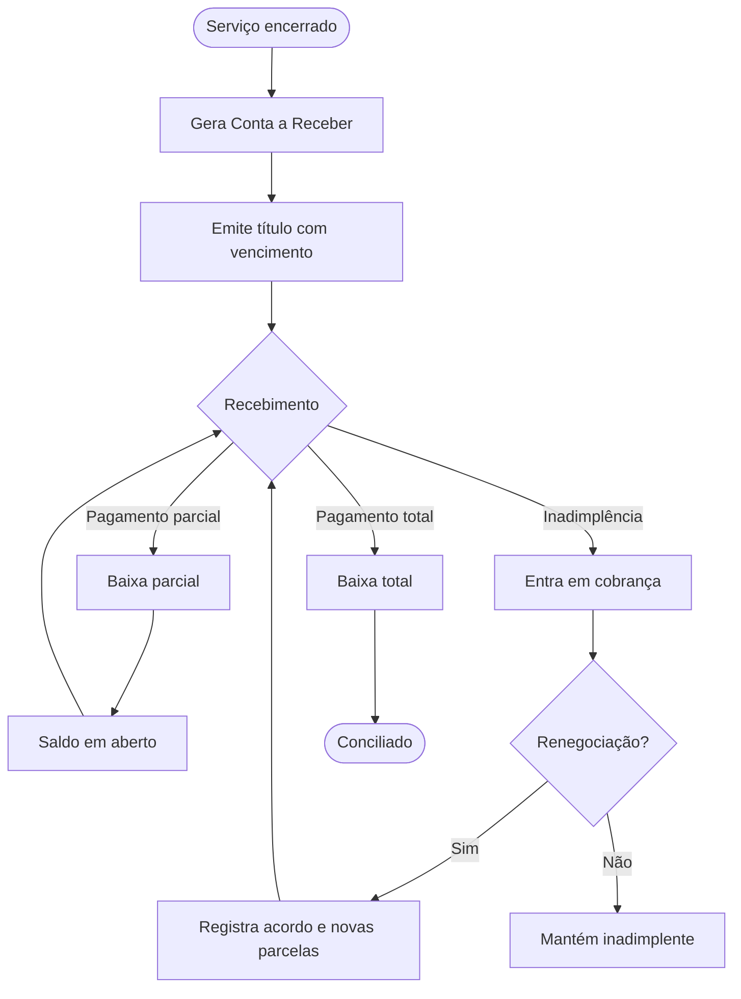

---

## 5. Fluxo Fiscal

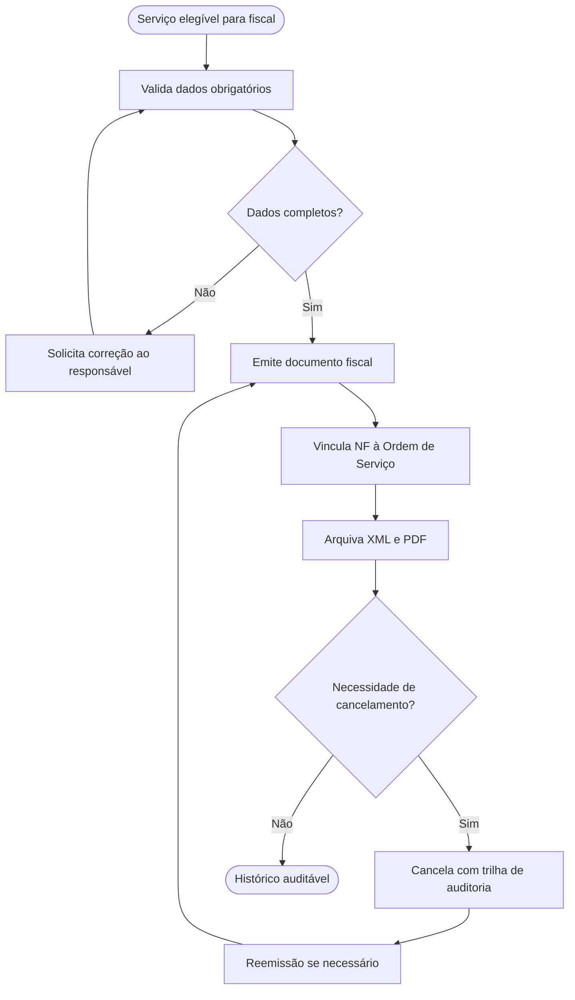

---

## 6. Fluxo de RH e Campo

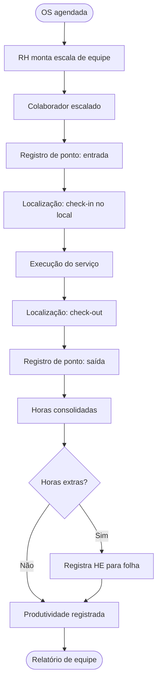

---

## 7. Estados do Inventário

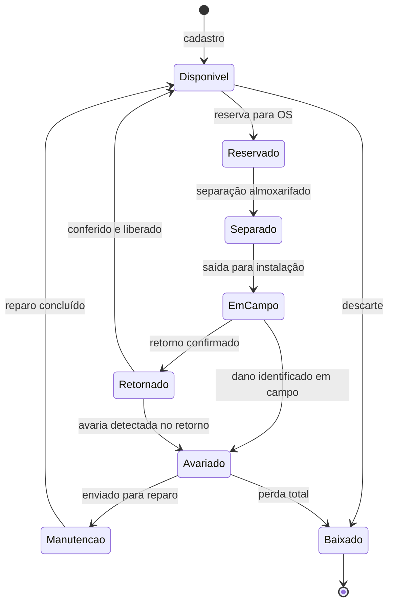

---

## 8. Estados da Frota

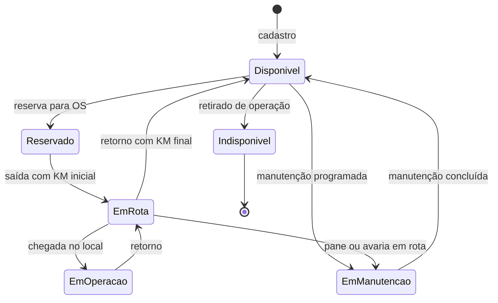

---

## 9. Mapa de Navegação

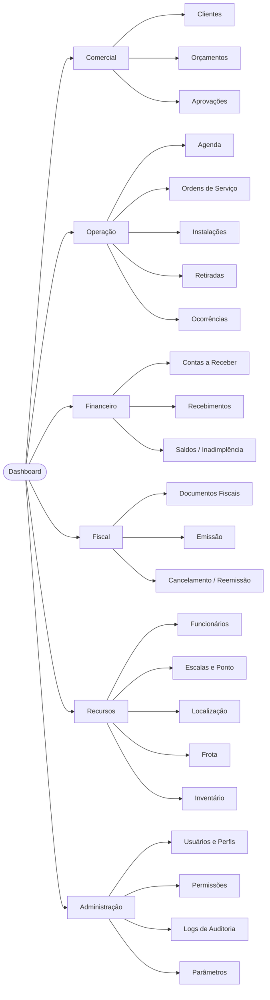

---

## 10. ERD — Domínio Comercial

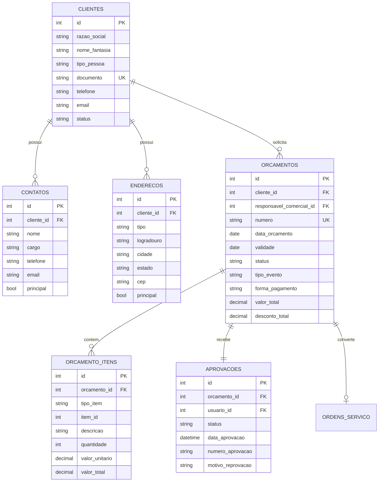

---

## 11. ERD — Domínio Operacional

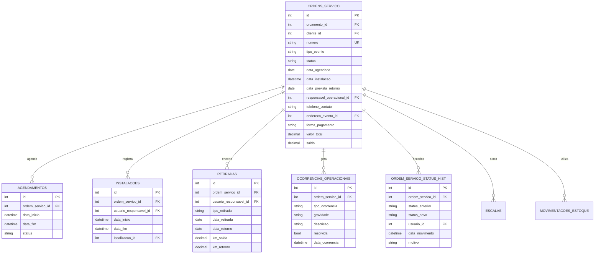

---

## 12. ERD — Domínio Financeiro e Fiscal

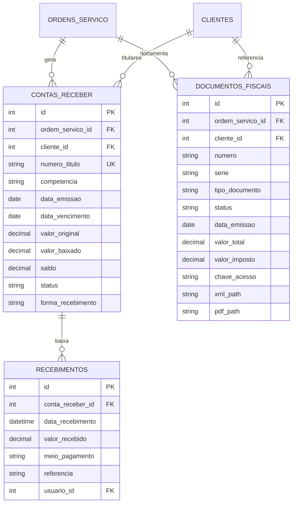

---

## 13. ERD — Domínio de Recursos (RH, Frota e Inventário)

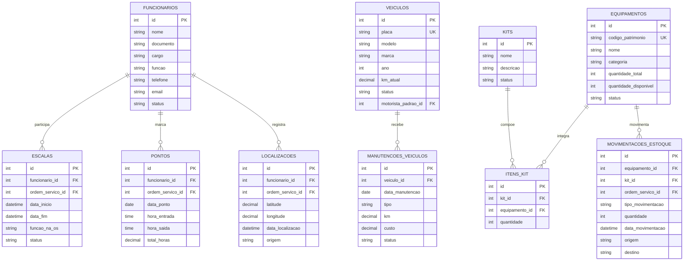

---

## 14. ERD — Domínio de Segurança e Auditoria

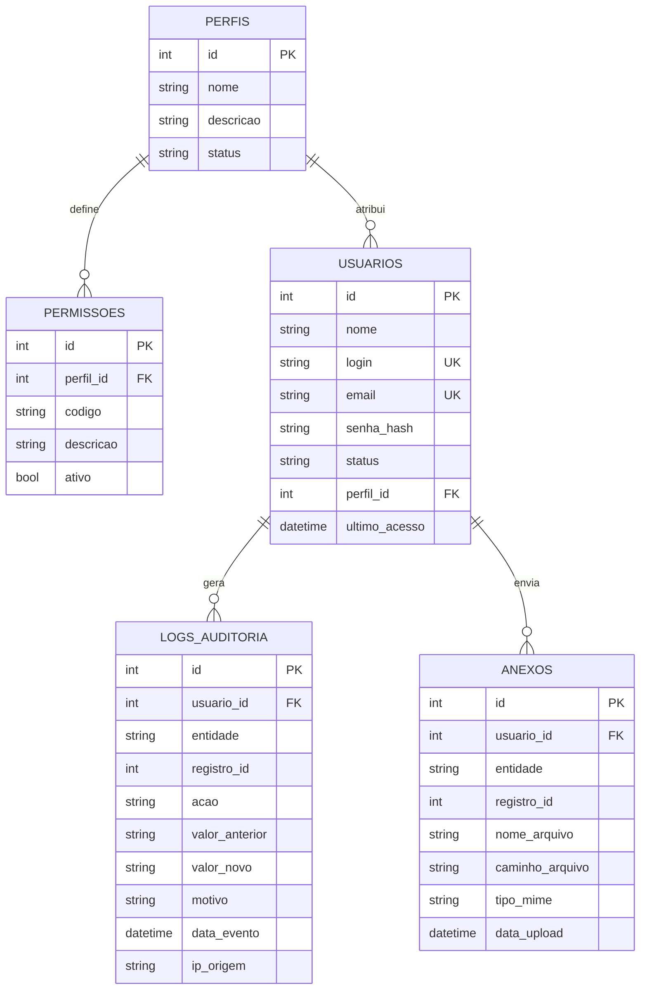

---

## 15. Roadmap por Fases

```mermaid
flowchart LR
    subgraph F1["Fase 1 — Núcleo Operacional"]
        direction TB
        f1a[Clientes]
        f1b[Orçamentos e Aprovação]
        f1c[Ordens de Serviço]
        f1d[Agenda]
        f1e[Inventário básico]
        f1f[Retirada e Retorno]
        f1g[Usuários e Perfis]
    end

    subgraph F2["Fase 2 — Financeiro e Fiscal"]
        direction TB
        f2a[Contas a Receber]
        f2b[Recebimentos e Baixas]
        f2c[Documentos Fiscais]
        f2d[Relatórios Financeiros]
    end

    subgraph F3["Fase 3 — Recursos e Campo"]
        direction TB
        f3a[Funcionários e Escalas]
        f3b[Ponto e Localização]
        f3c[Frota e Manutenção]
        f3d[Auditoria]
    end

    subgraph F4["Fase 4 — Inteligência"]
        direction TB
        f4a[Dashboards]
        f4b[Indicadores]
        f4c[Automações e Alertas]
        f4d[Integrações Externas]
        f4e[Portal do Cliente]
    end

    F1 --> F2 --> F3 --> F4
```
