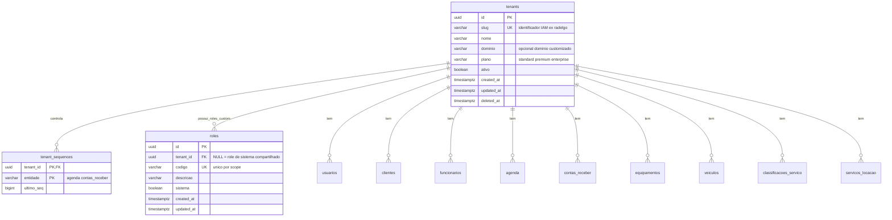
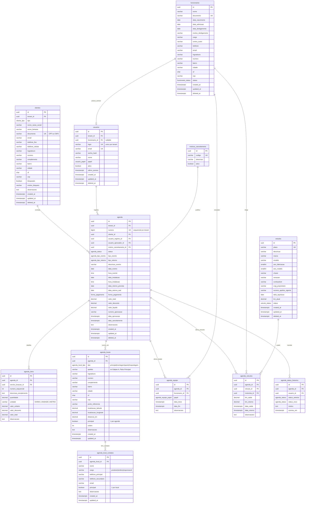
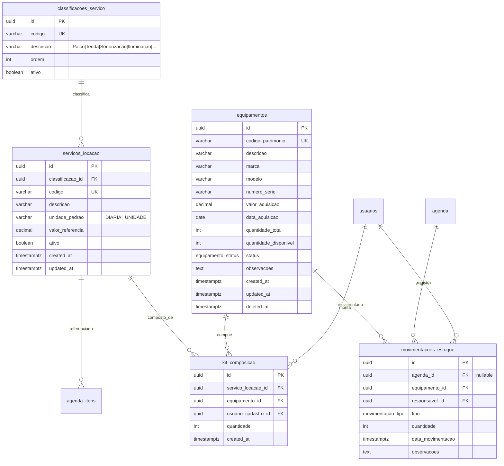
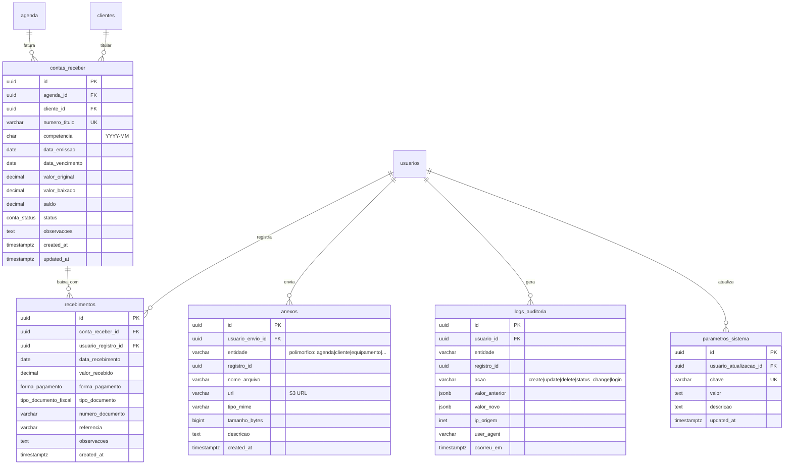

# ERD — Novo Sistema (tsure)

Modelo redesenhado a partir da análise do banco legado Radelgo (`database-access/exports/`). PostgreSQL, UUIDv7 em todos os PKs, auditoria padrão (`created_at`, `updated_at`, `deleted_at`).

## Multi-tenant (white-label)

Cada empresa opera em seu próprio contexto isolado via `tenant_id` em todas as tabelas de negócio.

**Login estilo AWS IAM:** `slug_do_tenant/login_usuario` (ex: `radelgo/admin`).
- O slug identifica o tenant; o login identifica o usuário dentro daquele tenant.
- O mesmo login pode existir em tenants diferentes.
- Autenticação: resolver tenant pelo slug → validar login+senha dentro do tenant.

**Roles de sistema** (`tenant_id IS NULL`): compartilhados entre todos os tenants, gerenciados pelo produto. **Roles custom** (`tenant_id = uuid`): criados por cada tenant para personalizar permissões.

**Números sequenciais por tenant:** `tenant_sequences` + `next_tenant_seq()` geram sequências independentes para `agenda.numero` e `contas_receber.numero_titulo`, evitando colisão entre tenants.

## Decisões de redesenho

- `TabEscala` + `TabEscalaRet` → **`agenda_equipe`** com `papel` enum (`instalacao` | `retorno`). Elimina duplicação estrutural.
- `TabSaidaVeic` + `TabSaidaVeicRet` → **`agenda_veiculos`** consolidado, uma linha por uso, com `km_saida` / `km_retorno` e motorista.
- `TabEquipSaida` → **`movimentacoes_estoque`** enriquecida com `tipo` (`saida` | `retorno` | `avaria` | `perda` | `baixa`), virando o livro-razão do estoque físico.
- `TabFotos` → **`anexos`** polimórfico (`entidade` + `registro_id`), aceita arquivos em qualquer entidade, campo `url` apontando para S3.
- `agenda` monolítica (42 colunas) → slim. **Endereços e contatos do evento extraídos para `agenda_locais` (1:N) e `agenda_local_contatos` (1:N por local)** — um evento pode ocorrer em múltiplos locais (montagem + apresentação + apoio), e cada local pode ter seus próprios contatos; status sai para `agenda_status_historico`; cancelamento referenciado em `motivos_cancelamento`.
- `TabPgto` plano → **`contas_receber`** (cabeçalho com saldo) + **`recebimentos`** (baixas). Suporta parcelas, baixa parcial e renegociação.
- Status com **ENUM nativo PostgreSQL** + tabela de histórico de transições.
- `TabKit` → **`kit_composicao`** com unique (`servico_locacao_id`, `equipamento_id`).
- Descartados: `FanalOper` (stub vazio), `CadDepto` / `CadSetor` (legado de outro ERP), `CadSys` → substituído por `parametros_sistema` key-value.
- `CadFunc.NomFunc` etc. expandidos para `nome`, `data_nascimento`, etc. (sem abreviações, sem `Func`/`Tab`/`Cad`).

## Enums PostgreSQL

```sql
CREATE TYPE cliente_tipo          AS ENUM ('pessoa_fisica', 'pessoa_juridica');
CREATE TYPE funcionario_status    AS ENUM ('ativo', 'desligado', 'afastado');
CREATE TYPE usuario_papel         AS ENUM ('admin', 'comercial', 'operacao', 'financeiro', 'fiscal', 'campo');
CREATE TYPE agenda_status         AS ENUM ('orcamento', 'em_analise', 'aprovado', 'agendado', 'em_execucao', 'aguardando_retorno', 'finalizado', 'cancelado');
CREATE TYPE agenda_tipo_evento    AS ENUM ('particular', 'licitacao', 'cortesia', 'recorrente');
CREATE TYPE agenda_tipo_retorno   AS ENUM ('mesma_equipe', 'outra_equipe');
CREATE TYPE agenda_local_tipo     AS ENUM ('principal', 'montagem', 'apoio', 'hospedagem', 'estacionamento');
CREATE TYPE agenda_equipe_papel   AS ENUM ('instalacao', 'retorno');
CREATE TYPE veiculo_status        AS ENUM ('disponivel', 'reservado', 'em_rota', 'em_manutencao', 'indisponivel');
CREATE TYPE equipamento_status    AS ENUM ('disponivel', 'em_uso', 'em_manutencao', 'baixado');
CREATE TYPE movimentacao_tipo     AS ENUM ('saida', 'retorno', 'avaria', 'perda', 'baixa', 'manutencao');
CREATE TYPE forma_pagamento       AS ENUM ('dinheiro', 'cheque', 'transferencia', 'pix', 'boleto', 'cartao');
CREATE TYPE tipo_documento_fiscal AS ENUM ('recibo', 'nota_fiscal', 'cupom');
CREATE TYPE conta_status          AS ENUM ('previsto', 'faturado', 'em_aberto', 'parcial', 'pago', 'renegociado', 'cancelado');
```

---

## ERD — Governança Multi-tenant



---

## ERD — Núcleo Operacional



---

## ERD — Catálogo e Estoque



---

## ERD — Financeiro, Anexos e Governança



---

## Mapa Legado → Novo

| Legado                      | Novo                            | Mudança principal                                        |
|-----------------------------|---------------------------------|----------------------------------------------------------|
| `TabClientes`               | `clientes`                      | Endereço inline mantido; documento UK; soft-delete       |
| `CadFunc`                   | `funcionarios`                  | Colunas expandidas; status como enum                     |
| `CadUsuario`                | `usuarios`                      | FK opcional para `funcionarios`; papel como enum         |
| `TabVeiculo`                | `veiculos`                      | `ano_fabricacao`/`ano_modelo` separados; status como enum|
| `TabAgenda`                 | `agenda` + `agenda_status_historico` + `agenda_locais` + `agenda_local_contatos` | 42 colunas slim; endereços/GPS extraídos como 1:N (multi-local); contatos do evento como 1:N por local; histórico fora; cancelamento por FK |
| `TabAgendaItens`            | `agenda_itens`                  | FK explícita para `servicos_locacao`                     |
| `TabEscala` + `TabEscalaRet`| `agenda_equipe`                 | Tabela única com `papel` enum                            |
| `TabSaidaVeic` + `TabSaidaVeicRet` | `agenda_veiculos`        | Tabela única, uma linha por uso completo, com motorista  |
| `TabEquipSaida`             | `movimentacoes_estoque`         | Vira livro-razão com `tipo` (saida/retorno/avaria/...)   |
| `TabFotos`                  | `anexos`                        | Polimórfico; campo `url` S3-compatible                   |
| `TabKit`                    | `kit_composicao`                | Unique composto; clareza semântica                       |
| `CadLocacao`                | `servicos_locacao`              | FK para `classificacoes_servico` (era texto solto)       |
| `CadClass`                  | `classificacoes_servico`        | Tabela lookup formal                                     |
| `TabEquip`                  | `equipamentos`                  | `quantidade_total`/`quantidade_disponivel` explícitos    |
| `TabPgto`                   | `contas_receber` + `recebimentos` | Cabeçalho + baixas; suporta parcelas                   |
| `TabMotCanc`                | `motivos_cancelamento`          | Mantido como lookup                                      |
| `TabCidade` + `CadUF`       | dropadas                        | Cidade/UF inline nos endereços + lista de UFs no app    |
| `CadDepto` + `CadSetor`     | dropadas                        | Legado de outro ERP, sem uso real                        |
| `CadSys`                    | `parametros_sistema`            | Key-value genérico                                       |
| `FanalOper`                 | dropada                         | Stub vazio no legado                                     |
| —                           | `logs_auditoria`                | Trilha de auditoria universal (novo)                     |
| —                           | `tenants`                       | Multi-tenant: cada empresa opera em contexto isolado     |
| —                           | `tenant_sequences`              | Sequências numéricas independentes por tenant e entidade |
| —                           | `user_sessions`                 | Sessões web (cookie BFF) e refresh tokens mobile (novo)  |
