# ERD Logico - ERP de Locacoes e Leasing de Projetos

## 1. Objetivo

Representar de forma textual as entidades principais e seus relacionamentos para orientar o banco de dados e a API.

## 2. Entidades Principais

- `clientes`
- `contatos`
- `enderecos`
- `orcamentos`
- `orcamento_itens`
- `aprovacoes`
- `ordens_servico`
- `agendamentos`
- `instalacoes`
- `retiradas`
- `ocorrencias_operacionais`
- `contas_receber`
- `recebimentos`
- `documentos_fiscais`
- `funcionarios`
- `escalas`
- `pontos`
- `localizacoes`
- `veiculos`
- `manutencoes_veiculos`
- `equipamentos`
- `kits`
- `itens_kit`
- `movimentacoes_estoque`
- `usuarios`
- `perfis`
- `permissoes`
- `logs_auditoria`
- `anexos`

## 3. Relacionamentos

### 3.1 Cliente

- um cliente possui varios contatos;
- um cliente possui varios enderecos;
- um cliente possui varios orcamentos;
- um cliente possui varias ordens de servico;
- um cliente possui varios titulos financeiros;
- um cliente pode possuir varios documentos fiscais.

### 3.2 Orcamento

- um orcamento pertence a um cliente;
- um orcamento possui varios itens;
- um orcamento possui uma aprovacao principal;
- um orcamento pode originar uma ordem de servico.

### 3.3 Ordem de Servico

- uma ordem de servico pertence a um orcamento;
- uma ordem de servico pertence a um cliente;
- uma ordem de servico possui varios agendamentos;
- uma ordem de servico possui instalacoes;
- uma ordem de servico possui retiradas;
- uma ordem de servico possui ocorrencias;
- uma ordem de servico possui contas a receber;
- uma ordem de servico possui documentos fiscais.

### 3.4 Funcionario

- um funcionario pode possuir varias escalas;
- um funcionario pode possuir varios pontos;
- um funcionario pode possuir varias localizacoes;
- um funcionario pode aparecer como responsavel operacional.

### 3.5 Veiculo

- um veiculo pode ter varias manutencoes;
- um veiculo pode ser associado a varias ordens de servico ao longo do tempo;
- um veiculo pode possuir historico de uso.

### 3.6 Inventario

- um equipamento pode compor varios kits;
- um kit possui varios itens;
- um equipamento pode ter varias movimentacoes;
- uma movimentacao pode ser vinculada a uma ordem de servico.

### 3.7 Seguranca e Auditoria

- um usuario pertence a um perfil;
- um perfil possui varias permissoes;
- um usuario gera logs de auditoria;
- um usuario pode anexar arquivos.

## 4. Cardinalidades Textuais

- `clientes 1:N contatos`
- `clientes 1:N enderecos`
- `clientes 1:N orcamentos`
- `orcamentos 1:N orcamento_itens`
- `orcamentos 1:1 aprovacoes`
- `orcamentos 1:1 ordens_servico`
- `ordens_servico 1:N agendamentos`
- `ordens_servico 1:N instalacoes`
- `ordens_servico 1:N retiradas`
- `ordens_servico 1:N ocorrencias_operacionais`
- `ordens_servico 1:N contas_receber`
- `contas_receber 1:N recebimentos`
- `ordens_servico 1:N documentos_fiscais`
- `funcionarios 1:N escalas`
- `funcionarios 1:N pontos`
- `funcionarios 1:N localizacoes`
- `veiculos 1:N manutencoes_veiculos`
- `kits 1:N itens_kit`
- `equipamentos 1:N itens_kit`
- `equipamentos 1:N movimentacoes_estoque`
- `usuarios 1:N logs_auditoria`
- `usuarios 1:N anexos`
- `perfis 1:N permissoes`

## 5. Chaves Estrangeiras Sugeridas

- `contatos.cliente_id -> clientes.id`
- `enderecos.cliente_id -> clientes.id`
- `orcamentos.cliente_id -> clientes.id`
- `orcamentos.responsavel_comercial_id -> usuarios.id`
- `orcamento_itens.orcamento_id -> orcamentos.id`
- `aprovacoes.orcamento_id -> orcamentos.id`
- `aprovacoes.usuario_id -> usuarios.id`
- `ordens_servico.orcamento_id -> orcamentos.id`
- `ordens_servico.cliente_id -> clientes.id`
- `ordens_servico.responsavel_operacional_id -> funcionarios.id`
- `agendamentos.ordem_servico_id -> ordens_servico.id`
- `instalacoes.ordem_servico_id -> ordens_servico.id`
- `retiradas.ordem_servico_id -> ordens_servico.id`
- `ocorrencias_operacionais.ordem_servico_id -> ordens_servico.id`
- `contas_receber.ordem_servico_id -> ordens_servico.id`
- `contas_receber.cliente_id -> clientes.id`
- `recebimentos.conta_receber_id -> contas_receber.id`
- `documentos_fiscais.ordem_servico_id -> ordens_servico.id`
- `funcionarios` relacao com `usuarios` quando houver conta de acesso
- `escalas.funcionario_id -> funcionarios.id`
- `pontos.funcionario_id -> funcionarios.id`
- `localizacoes.funcionario_id -> funcionarios.id`
- `manutencoes_veiculos.veiculo_id -> veiculos.id`
- `itens_kit.kit_id -> kits.id`
- `itens_kit.equipamento_id -> equipamentos.id`
- `movimentacoes_estoque.equipamento_id -> equipamentos.id`
- `movimentacoes_estoque.ordem_servico_id -> ordens_servico.id`
- `usuarios.perfil_id -> perfis.id`
- `logs_auditoria.usuario_id -> usuarios.id`
- `anexos.usuario_id -> usuarios.id`

## 6. Pontos de Unicidade

- `clientes.documento`
- `orcamentos.numero`
- `ordens_servico.numero`
- `veiculos.placa`
- `usuarios.login`
- `usuarios.email`

## 7. Fluxo de Integridade

1. cliente e cadastrado;
2. orcamento e criado;
3. aprovacao e registrada;
4. OS e gerada;
5. agenda, recursos e estoque sao vinculados;
6. execucao e encerramento sao registrados;
7. financeiro e fiscal recebem os dados finais;
8. auditoria guarda o historico.

## 8. Sugestao Visual de Diagrama

```text
clientes -> orcamentos -> ordens_servico -> contas_receber -> recebimentos
clientes -> ordens_servico -> documentos_fiscais
ordens_servico -> agendamentos / instalacoes / retiradas / ocorrencias_operacionais
funcionarios -> escalas / pontos / localizacoes
veiculos -> manutencoes_veiculos
kits -> itens_kit -> equipamentos -> movimentacoes_estoque
usuarios -> logs_auditoria / anexos
perfis -> permissoes
```

## 9. Observacao

Este ERD e logico e pode ser convertido em diagrama grafico posteriormente, em ferramenta de modelagem ou Mermaid.

## 10. Diagrama Mermaid

```mermaid
erDiagram
    CLIENTES ||--o{ CONTATOS : possui
    CLIENTES ||--o{ ENDERECOS : possui
    CLIENTES ||--o{ ORCAMENTOS : solicita
    CLIENTES ||--o{ ORDENS_SERVICO : origina
    CLIENTES ||--o{ CONTAS_RECEBER : gera
    CLIENTES ||--o{ DOCUMENTOS_FISCAIS : referencia

    ORCAMENTOS ||--o{ ORCAMENTO_ITENS : contem
    ORCAMENTOS ||--|| APROVACOES : recebe
    ORCAMENTOS ||--o| ORDENS_SERVICO : converte

    ORDENS_SERVICO ||--o{ AGENDAMENTOS : agenda
    ORDENS_SERVICO ||--o{ INSTALACOES : registra
    ORDENS_SERVICO ||--o{ RETIRADAS : encerra
    ORDENS_SERVICO ||--o{ OCORRENCIAS_OPERACIONAIS : gera
    ORDENS_SERVICO ||--o{ CONTAS_RECEBER : cobra
    ORDENS_SERVICO ||--o{ DOCUMENTOS_FISCAIS : documenta

    CONTAS_RECEBER ||--o{ RECEBIMENTOS : baixa

    FUNCIONARIOS ||--o{ ESCALAS : participa
    FUNCIONARIOS ||--o{ PONTOS : marca
    FUNCIONARIOS ||--o{ LOCALIZACOES : registra

    VEICULOS ||--o{ MANUTENCOES_VEICULOS : recebe

    KITS ||--o{ ITENS_KIT : compoe
    EQUIPAMENTOS ||--o{ ITENS_KIT : integra
    EQUIPAMENTOS ||--o{ MOVIMENTACOES_ESTOQUE : movimenta
    ORDENS_SERVICO ||--o{ MOVIMENTACOES_ESTOQUE : utiliza

    PERFIS ||--o{ PERMISSOES : define
    USUARIOS ||--o{ LOGS_AUDITORIA : gera
    USUARIOS ||--o{ ANEXOS : envia

    CLIENTES {
        int id
        string razao_social
        string nome_fantasia
        string documento
        string status
    }

    CONTATOS {
        int id
        int cliente_id
        string nome
        string telefone
        string email
    }

    ENDERECOS {
        int id
        int cliente_id
        string logradouro
        string cidade
        string estado
    }

    ORCAMENTOS {
        int id
        int cliente_id
        int responsavel_comercial_id
        string numero
        string status
        decimal valor_total
    }

    ORCAMENTO_ITENS {
        int id
        int orcamento_id
        string tipo_item
        string descricao
        decimal valor_total
    }

    APROVACOES {
        int id
        int orcamento_id
        int usuario_id
        string status
    }

    ORDENS_SERVICO {
        int id
        int orcamento_id
        int cliente_id
        string numero
        string status
        date data_agendada
    }

    AGENDAMENTOS {
        int id
        int ordem_servico_id
        datetime data_inicio
        datetime data_fim
        string status
    }

    INSTALACOES {
        int id
        int ordem_servico_id
        int usuario_responsavel_id
        datetime data_inicio
        datetime data_fim
    }

    RETIRADAS {
        int id
        int ordem_servico_id
        int usuario_responsavel_id
        date data_retirada
        date data_retorno
    }

    OCORRENCIAS_OPERACIONAIS {
        int id
        int ordem_servico_id
        string tipo_ocorrencia
        string descricao
    }

    CONTAS_RECEBER {
        int id
        int ordem_servico_id
        int cliente_id
        string numero_titulo
        decimal saldo
    }

    RECEBIMENTOS {
        int id
        int conta_receber_id
        datetime data_recebimento
        decimal valor_recebido
    }

    DOCUMENTOS_FISCAIS {
        int id
        int ordem_servico_id
        int cliente_id
        string numero
        string status
    }

    FUNCIONARIOS {
        int id
        string nome
        string cargo
        string status
    }

    ESCALAS {
        int id
        int funcionario_id
        int ordem_servico_id
        datetime data_inicio
        datetime data_fim
    }

    PONTOS {
        int id
        int funcionario_id
        int ordem_servico_id
        date data_ponto
        time hora_entrada
        time hora_saida
    }

    LOCALIZACOES {
        int id
        int funcionario_id
        int ordem_servico_id
        decimal latitude
        decimal longitude
        datetime data_localizacao
    }

    VEICULOS {
        int id
        string placa
        string modelo
        string status
    }

    MANUTENCOES_VEICULOS {
        int id
        int veiculo_id
        date data_manutencao
        string tipo
        decimal custo
    }

    KITS {
        int id
        string nome
        string status
    }

    ITENS_KIT {
        int id
        int kit_id
        int equipamento_id
        int quantidade
    }

    EQUIPAMENTOS {
        int id
        string codigo_patrimonio
        string nome
        string status
    }

    MOVIMENTACOES_ESTOQUE {
        int id
        int equipamento_id
        int kit_id
        int ordem_servico_id
        string tipo_movimentacao
        int quantidade
    }

    USUARIOS {
        int id
        string nome
        string login
        string email
        string status
    }

    PERFIS {
        int id
        string nome
        string status
    }

    PERMISSOES {
        int id
        int perfil_id
        string codigo
        string descricao
    }

    LOGS_AUDITORIA {
        int id
        int usuario_id
        string entidade
        string acao
        datetime data_evento
    }

    ANEXOS {
        int id
        int usuario_id
        string entidade
        string nome_arquivo
        string caminho_arquivo
    }
```


